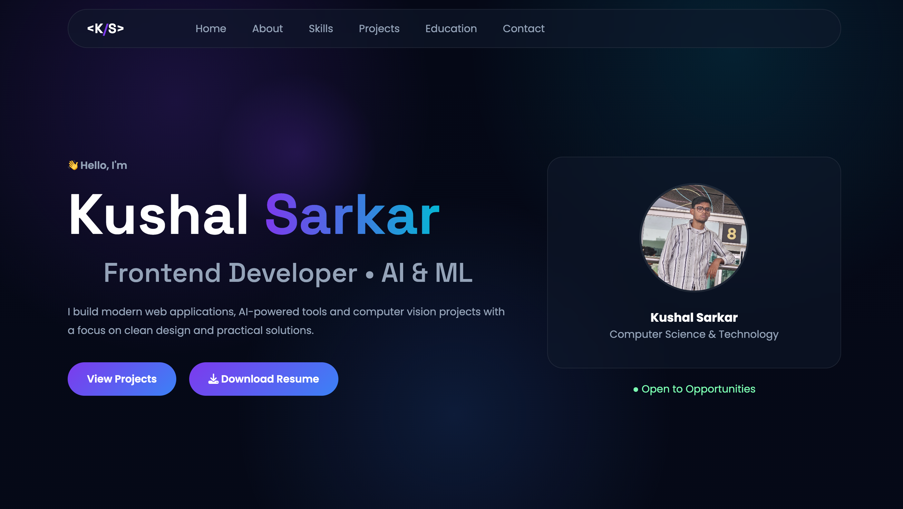

# 🌐 Kushal Sarkar - Developer Portfolio

A modern and responsive developer portfolio showcasing my projects, technical skills, and passion for software development, AI, and computer vision.

---

## 📸 Home Page

<p align="center">
  
</p>

---

## ✨ Features

- 🎨 Modern Glassmorphism UI
- 🌙 Dark Theme with Light Mode Support
- 📱 Fully Responsive Design
- ⚡ Smooth Animations & Scrolling
- 👤 About Section
- 🛠 Skills Showcase
- 🚀 Featured Projects
- 🐙 GitHub Profile Section
- 📄 Downloadable Resume
- 📬 Clickable Contact Cards
- 🎯 Clean & Professional Design

---

## 🛠 Tech Stack

### Frontend
- HTML5
- CSS3
- JavaScript (ES6)

### UI / UX
- Glassmorphism
- CSS Variables
- Flexbox
- CSS Grid
- Responsive Design

### Tools
- Git
- GitHub
- VS Code
- Font Awesome

---

## 📂 Sections

- 🏠 Home
- 👤 About
- 🛠 Skills
- 🚀 Projects
- 🐙 GitHub
- 📬 Contact

---

## 🚀 Getting Started

### Clone the repository

```bash
git clone https://github.com/ByteBender9/portfolio.git
```

### Navigate into the project

```bash
cd portfolio
```

### Run

Open `index.html`

or use **Live Server** in VS Code.

---

## 📁 Project Structure

```
Portfolio
│
├── assets
│   ├── css
│   ├── images
│   ├── js
│   └── resume
│
├── index.html
├── README.md
├── robots.txt
├── sitemap.xml
└── LICENSE
```

---

## 📬 Contact

- 📧 Email: **connect.kushals@gmail.com**
- 🐙 GitHub: **ByteBender9**
- 💼 LinkedIn: **https://www.linkedin.com/in/kushalsarkar**

---

## 🚀 Future Improvements

- [ ] Project Details Modal
- [ ] LeetCode Integration
- [ ] Enhanced Animations
- [ ] More Projects
- [ ] Custom Domain
- [ ] Blog Section

---

## 👨‍💻 Developed By

**Kushal Sarkar**

⭐ If you like this project, consider giving it a star!