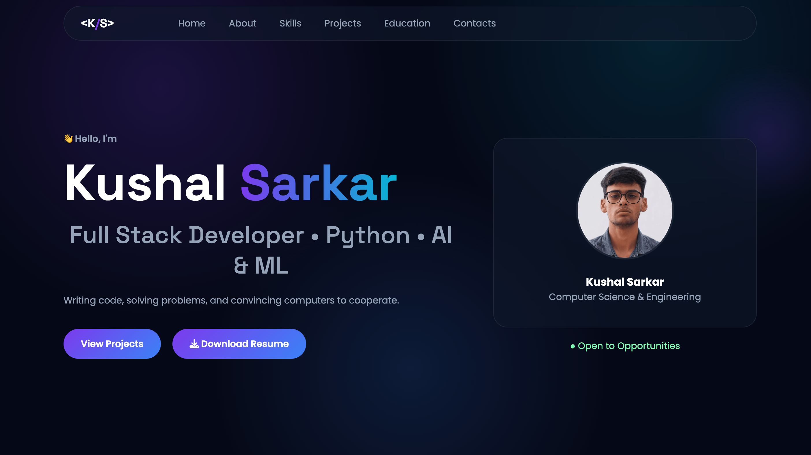

# 🌐 Kushal Sarkar — Developer Portfolio

A modern, responsive developer portfolio showcasing my featured projects, technical skills, education, and work across web development, AI, and computer vision.

---

## 📸 Home Page

<p align="center">
  
</p>

---

## ✨ Features

- 🎨 Modern dark glassmorphism UI
- 📱 Responsive design for desktop, tablet, and mobile
- ⚡ Smooth scrolling and subtle animations
- 👤 About section with portfolio statistics
- 🛠 Technical skills showcase
- 🚀 5 featured projects
- 🐙 GitHub profile section
- 📄 Downloadable resume
- 📬 Clickable contact cards
- 🎯 Clean and professional developer-focused design

---

## 🛠 Tech Stack

### Frontend
- HTML5
- CSS3
- JavaScript (ES6)

### UI / UX
- Glassmorphism
- CSS Variables
- Flexbox
- CSS Grid
- Responsive Design

### Tools
- Git
- GitHub
- VS Code
- Font Awesome

---

## 📂 Portfolio Sections

- 🏠 Home
- 👤 About
- 🛠 Skills
- 🚀 Featured Projects
- 🎓 Education
- 🐙 GitHub
- 📬 Contact

---

## 🚀 Featured Projects

### 1. GitMaster
An interactive platform for learning Git through structured lessons, commands, and quizzes.

🔗 [Live Demo](https://git-master-lake.vercel.app/)

### 2. DoChat
A modern real-time chat application focused on messaging, channels, responsive design, and a clean user experience.

🔗 [GitHub](https://github.com/ByteBender9/DoChat)

### 3. LipVision
An AI-powered lip-reading system using deep learning, OpenCV, MediaPipe, and TensorFlow.

🔗 [GitHub](https://github.com/ByteBender9/LipVision)

### 4. Jarvis Voice Assistant
A desktop voice assistant built with Python for voice commands, automation, and face authentication.

🔗 [GitHub](https://github.com/ByteBender9/Jarvis_VoiceAssistant)

### 5. Cyberbullying Detection
A machine learning web application for detecting cyberbullying using NLP and text classification.

🔗 [GitHub](https://github.com/ByteBender9/Cyberbullying_Detection)

---

## 📊 Portfolio Highlights

| Metric | Value |
|---|---:|
| GitHub Repositories | 12 |
| Featured Projects | 5 |
| AI & ML Projects | 4 |
| Technologies | 8+ |

---

## 🚀 Getting Started

### Clone the repository

```bash
git clone https://github.com/ByteBender9/portfolio.git
```

### Navigate into the project

```bash
cd portfolio
```

### Run locally

Open `index.html` directly in your browser, or use **Live Server** in VS Code.

---

## 📁 Project Structure

```text
Portfolio
│
├── assets
│   ├── css
│   ├── images
│   ├── js
│   └── resume
│
├── index.html
├── README.md
└── LICENSE
```

---

## 📬 Contact

- 📧 Email: **connect.kushals@gmail.com**
- 🐙 GitHub: **ByteBender9**
- 💼 LinkedIn: **Kushal Sarkar**

---

## 🚀 Future Improvements

- [ ] LeetCode integration
- [ ] Enhanced animations and micro-interactions
- [ ] More featured projects
- [ ] Custom domain
- [ ] Blog section

---

## 📄 License

This project is licensed under the MIT License. See the [LICENSE](LICENSE) file for details.

## 👨‍💻 Developed By

**Kushal Sarkar**

⭐ If you like this portfolio, consider giving the repository a star!
